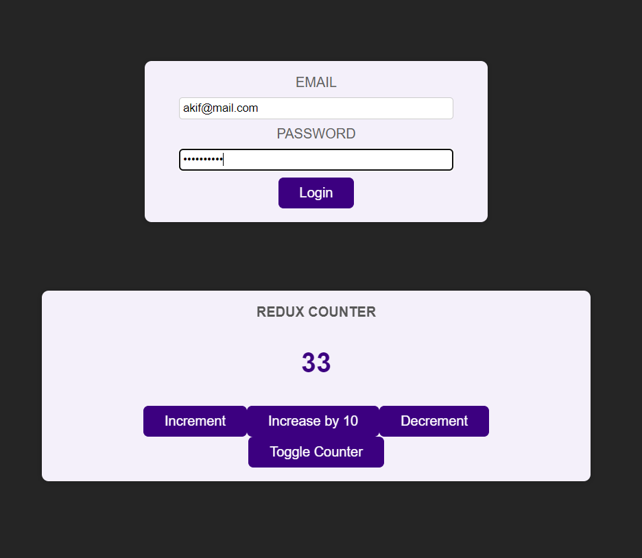

# react-redux
This is a React app that demonstrates the use of Redux for state management. The app consists of the following components:

- `Counter`: A simple counter that can be incremented or decremented by clicking buttons. The counter value is stored in the Redux store and updated by dispatching actions.
- `Header`: A header that displays the app title and a login/logout button. The button toggles the authentication state in the Redux store and shows a different text depending on the state.
- `Auth`: A component that renders a form to enter a username and password. The form validates the input and dispatches an action to set the authentication state in the Redux store.
- `UserProfile`: A component that renders a welcome message and a user avatar. The component only shows when the user is authenticated.
- `App`: The main component that wraps all the other components and uses `useSelector` to access the authentication state from the Redux store.

To run the app, you need to have Node.js and npm installed on your machine. Then, follow these steps:

- Clone the repository or download the zip file and extract it.
- Open a terminal and navigate to the project folder.
- Run `npm install` to install the dependencies.
- Run `npm install react react-redux` to install the dependencies.
- Run `npm install @reduxjs/toolkit` to install the dependencies.
- Run `npm start` to start the development server.
- Open your browser and go to `http://localhost:3000` to see the app in action.

